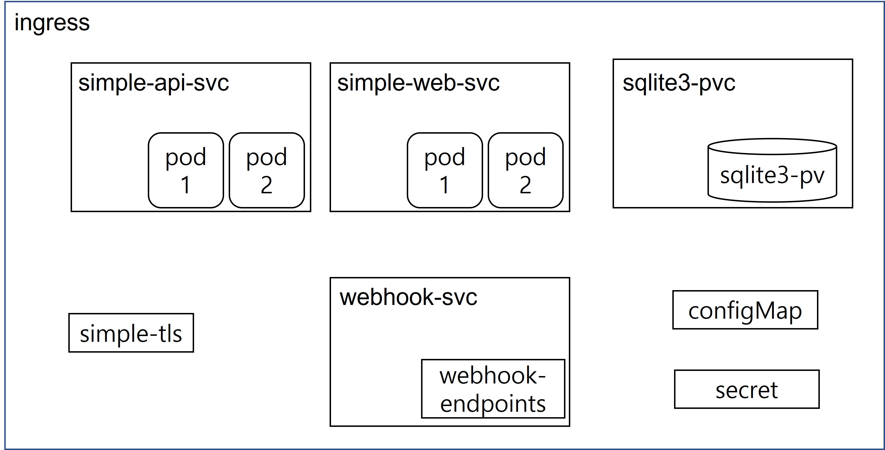
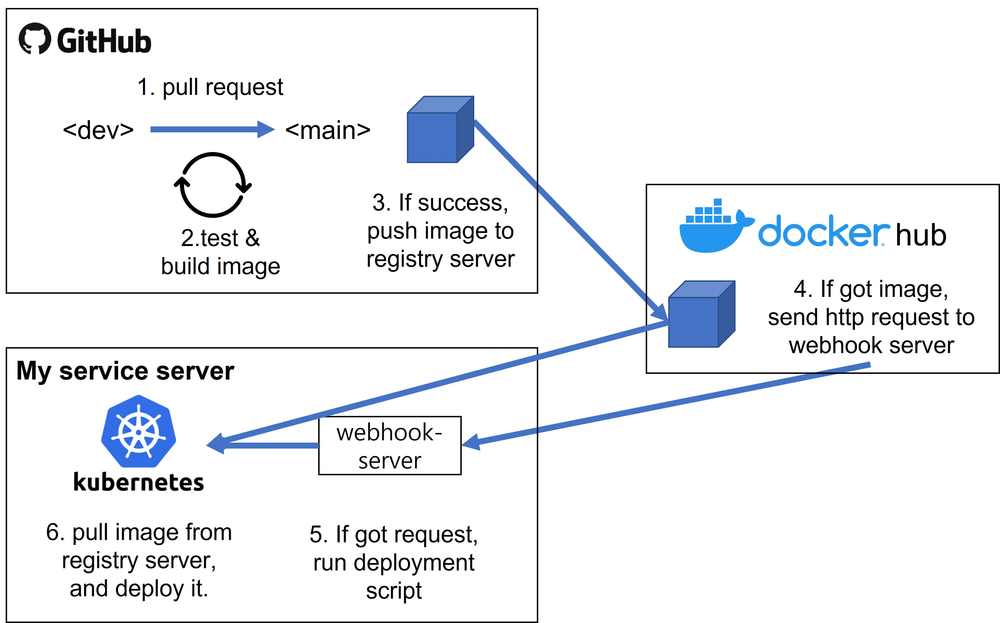

# simple-manifest

- 간단한 로커 관리 서비스([simple locker](https://isthereanymerch.com))의 배포에 사용하는 쿠버네티스 매니페스트 파일입니다.

## 쿠버네티스 구조

- 

## 초기 구축 명령

- 순서대로 실행해야합니다.
- 본인의 정보로 교체 후 사용해야합니다.
- ```bash
  # config and secret
  kubectl apply -f config.yml
  kubectl apply -f secret.yml

  # persistent volume
  kubectl apply -f sqlite3-pv.yml
  kubectl apply -f sqlite3-pvc.yml

  # webhook service
  kubectl apply -f webhook-endpoints.yml
  kubectl apply -f webhook-svc.yml

  # tls
  kubectl apply -f https://github.com/jetstack/cert-manager/releases/download/v1.6.0/cert-manager.yaml
  kubectl apply -f cluster-issuer.yml

  # deployment
  kubectl apply -f simple-api.yml
  kubectl apply -f simple-web.yml

  # ingress
  kubectl apply -f ingress.yml
  ```

## CI / CD

- 
- 설명
  - [simple locker](https://isthereanymerch.com)는 CI / CD가 구축 되어있습니다.  
    대략적인 과정을 간략하게 기술합니다.
- CI / CD 과정
  - [LOCAL] local dev branch에서 작업 후 remote dev branch로 push
  - [GITHUB] push 후 test가 진행됨, 만약 test 통과하면 main으로 merge 가능 상태로 변경.
  - [GITHUB] main으로 pull request 후 test가 진행됨,  
     만약 test가 통과하면 image build 후 registry server(여기서는 dockerhub)로 push
  - [DOCKERHUB] 새로운 image를 받으면, 지정한 webhook ip로 http 요청
  - [MY SERVICE SERVER] webhook 서버에서 http 요청을 받으면 지정한 배포 스크립트 실행
  - [MY SERVICE SERVER] 배포 스크립트는 갱신된 deployment 매니페스트를 pull 받고 적용시켜서 새 이미지를 배포

## 배포 스크립트 작성 시 주의사항

- 설명
  - 갱신된 deployment 매니페스트를 적용하기 전에  
    반드시 configMap과 sercet을 먼저 적용해야합니다.
  - configMap과 secret이 환경변수로 등록되게 설정하고 있어  
    deployment 적용 전 미리 로드되어야 변경 사항이 적용되기 때문입니다.
- 예시
  - ```bash
    # deployment simple-api script
    #!/usr/bin/env bash
    MANIFEST_DIR_PATH="/simple-manifest"
    SIMPLE_API_DIR_PATH="${MANIFEST_DIR_PATH}/simple-api"

    git --git-dir=${SIMPLE_API_DIR_PATH}/.git pull origin main
    kubectl apply -f ${MANIFEST_DIR_PATH}/config.yml
    kubectl apply -f ${MANIFEST_DIR_PATH}/secret.yml
    kubectl apply -f ${SIMPLE_API_DIR_PATH}/simple-api.yml
    ```

## 서브 모듈 업데이트

- 설명
  - 최초 simple-manifest repo를 clone 할 때,  
    simple-api와 simple-web이 빈 디렉토리일 것입니다.
  - 서브 모듈을 업데이트하여 코드를 받아줍니다.
- 명령
  - ```bash
    git submodule init
    git submodule update
    ```
